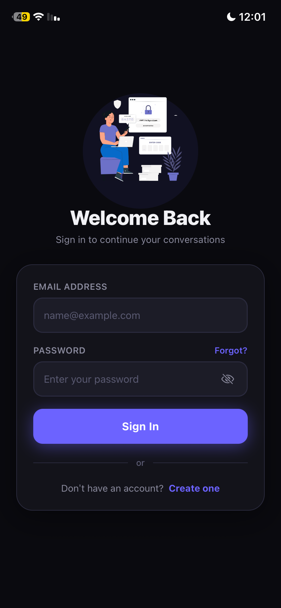
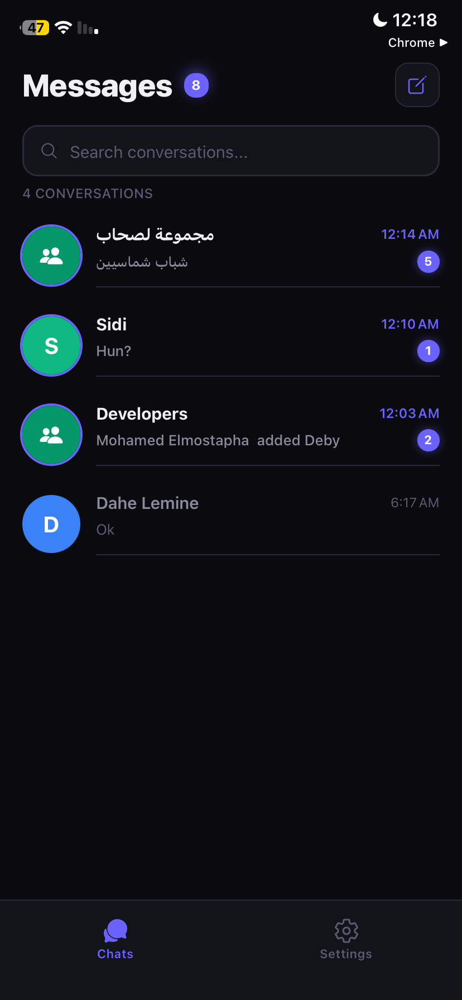
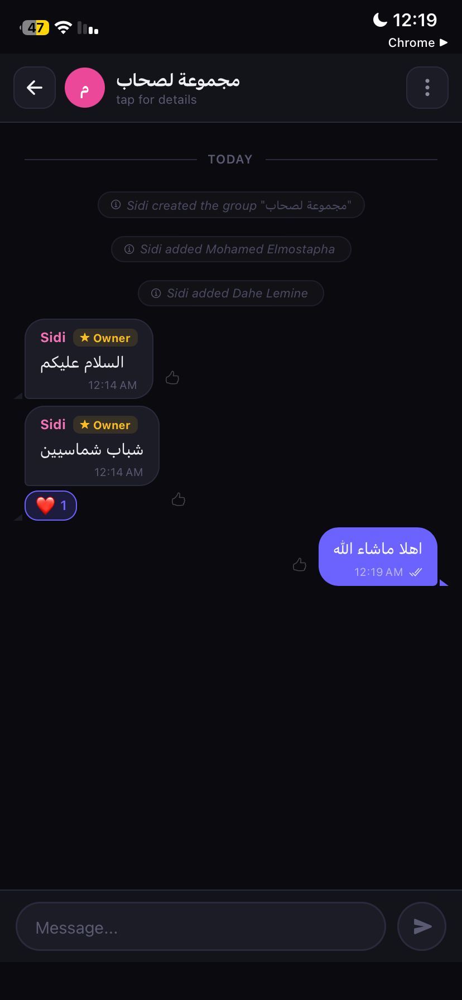
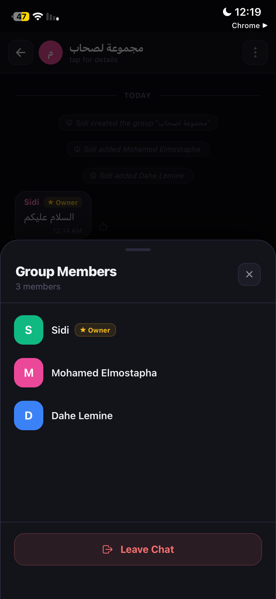
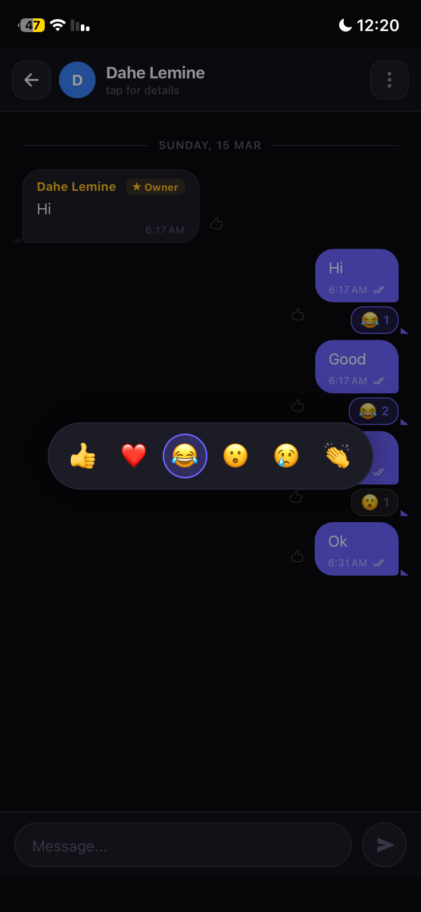
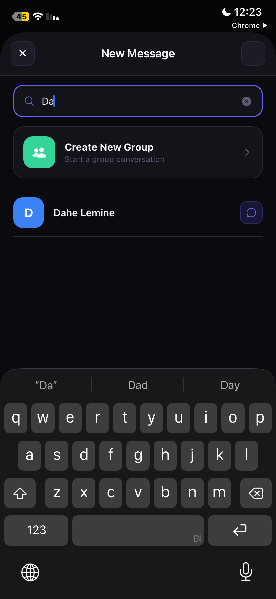
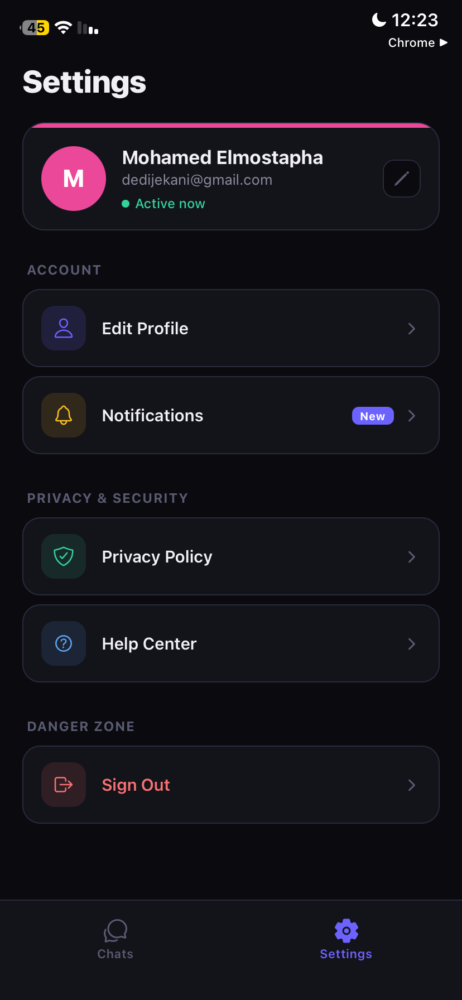

# 🚀 Ch6ari — Real-Time Chat Application

A full-stack mobile chat application built with React Native (Expo) and Supabase.  
Designed to simulate a **real-world scalable messaging system** with real-time communication, push notifications, and group management.

---

## 🏆 Key Highlights

- Real-time messaging using WebSockets (Supabase Realtime)
- Multi-device push notification system (FCM + APNs)
- Optimistic UI for instant user feedback
- Group chat system with roles and permissions
- Scalable relational database design

---

## 📱 Screenshots

| Login                             | Chats                             | Chat Room                       | Group Details                         |
| --------------------------------- | --------------------------------- | ------------------------------- | ------------------------------------- |
|  |  |  |  |

| Reactions                                 | Onboarding                                  | New Chat                                | Settings                              |
| ----------------------------------------- | ------------------------------------------- | --------------------------------------- | ------------------------------------- |
|  |  |  |  |

---

## 🎯 Why This Project

This project was built to understand how real-time systems work in production:

- Handling concurrent users
- Managing real-time events (messages, reactions)
- Delivering push notifications across devices
- Designing scalable backend architecture

---

## 🧱 Tech Stack

- React Native (Expo)
- TypeScript
- Supabase (PostgreSQL + Auth + Realtime)
- Expo Notifications (FCM + APNs)
- Expo Router

---

## ⚙️ Core Features

### 💬 Messaging

- Real-time chat (WebSocket)
- Optimistic UI (instant message display)
- Read receipts
- Message deletion (own messages)
- System messages (join/leave)

### 🔔 Push Notifications

- Multi-device support
- Android: Firebase FCM
- iOS: APNs via Expo
- Triggered via backend events

### 😀 Reactions

- Emoji reactions (👍 ❤️ 😂 😮 😢 👏)
- Real-time updates
- Toggle reactions

### 👥 Groups

- Create group chats
- Add/remove members
- Owner permissions
- Leave/delete group

### 🔐 Authentication

- Email/password authentication
- Password reset flow
- Secure session handling

---

## 🗄️ Database Design

Core entities:

- Users (profiles)
- Rooms (chat / groups)
- Messages
- Reactions
- Push Tokens (multi-device support)

---

## 🏗️ Architecture Overview

- Frontend: React Native (Expo)
- Backend: Supabase (BaaS)
- Realtime: WebSocket via Supabase
- Notifications: Expo Push API + FCM/APNs

---

## 🚀 Future Improvements

- End-to-end encryption (E2EE)
- Message media support (images, files)
- Typing indicators
- Offline message queue
- Performance optimization

---

## 🏁 Summary

This project demonstrates:

- Building a real-time system
- Handling live updates and concurrency
- Designing scalable backend structures
- Integrating push notification systems

Suitable as:

- Portfolio project
- Mobile system design case study
